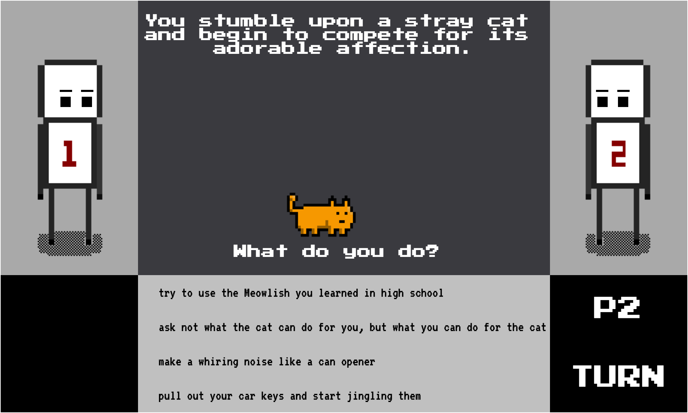

___

# The 2-Player, turn-based, stray cat coaxing simulator you've been waiting for!

Taking turns, two players attempt to convince a cat to come to their side of the game board using any means necessary.

Players attempt to find out what kind of cat they are dealing with using deductive reasoning. They then use that information to choose the best moves available to them on their turn. Players must pay careful attention to their opponent's choices, because they might reveal information the player can exploit when it's their turn to call that cat.

#### How to Play:
Use the mouse to select from a randomized set of choices each turn.

Play Catcallr <a href="https://alexkarevoll.github.io/catcallr/" title="Catcallr"> RIGHT HERE</a>.

---

### Development & Technologies

Cat Callr is being built using HTML, CSS, JavaScript, and the jQuery library

---

### User Stories

+ When I arrive at the website, I am greeted with a screen that briefly sets the scene.
+ I learn the rules of the game as I play. I am not given too much information and the game trusts my intelligence.
+ Hopefully I laugh, or at the very least smile quietly to myself.
+ I can play with a friend and the game feels balanced and fair.
+ Winning a game gives me a sense of accomplishment.
+ After completing my first game with a friend I am asked if I would like to play again and I will be able to do so immediatly.

---
### MVP
+ Cat that moves left and right based on player choices.
+ At least four different player choices.
+ Choices are selectable with the mouse.
+ Moving the cat to a player's win-line results in a victory for that player.

---
### Dream Features
+ Multiple levels
+ Cat animations
+ Cat's that leave after a certain number of turns
+ Scores that carry over game to game
+ Link to share game with friends
+ Randomized choices for maximum hilarity

---
### Credit where credit it due

Pixel Art Created With <a href="http://www.piskelapp.com/" title = "Piksel"> Piskel</a>

Logo Made with <a href="http://logomakr.com" title="Logo Maker">Logo Maker</a>
